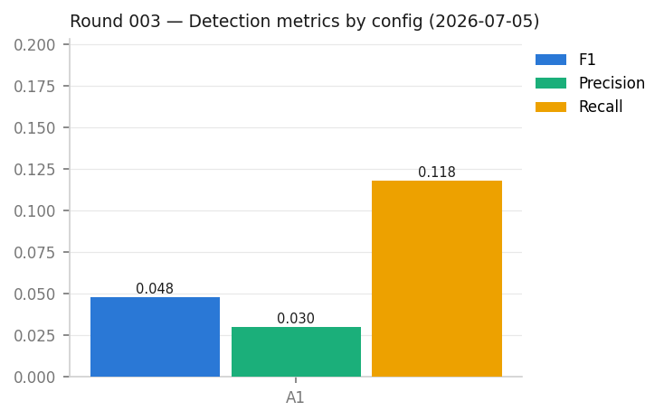
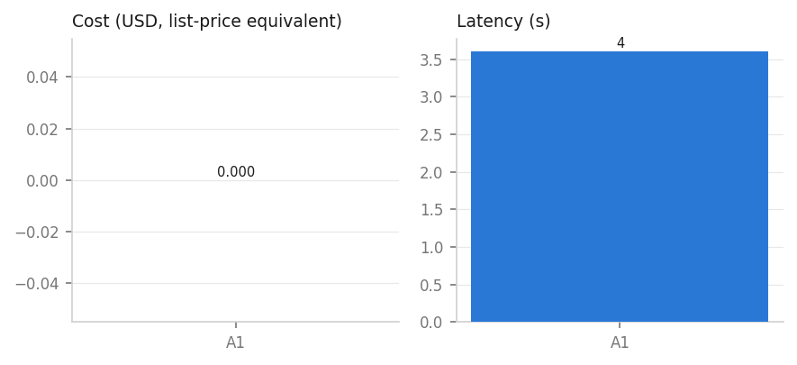

# 실험 003회차 — 2026-07-05

- 실험: E2smoke / 데이터: `data/E2_hospital/dirty.csv` / 구성: A1 / 반복: 1
- 오류율: None / 시드: None

| run_id | config | status | F1 | P | R | 지연(s) | USD |
|---|---|---|---|---|---|---|---|
| E2smoke-E2_hospital_dirty-A1-rep1 | A1 | ok | 0.0478 | 0.03 | 0.1179 | 3.6 | 0.0 |

## 시각화

원본 로그: `runs/` (정본), 이 폴더의 JSON은 사본
