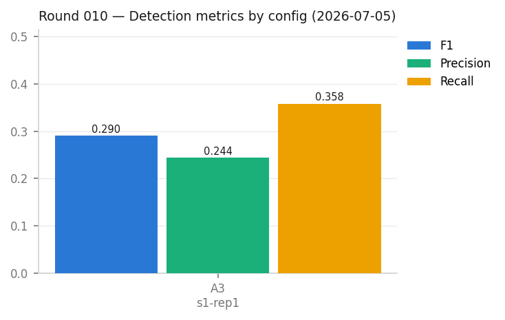
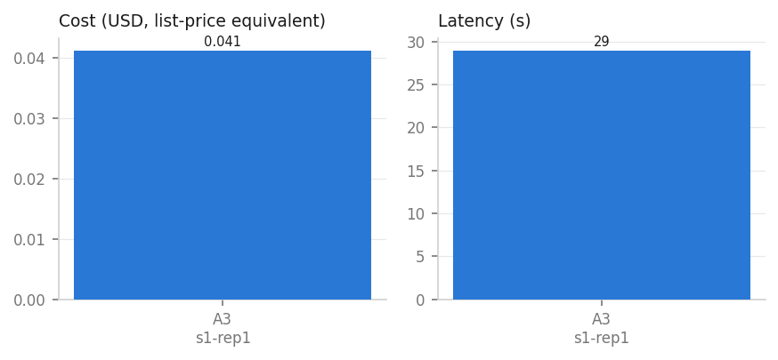

# 실험 010회차 — 2026-07-05

- 실험: GEMv1 / 데이터: `runs/injected/S1_customer_1000_r10_s1.json` / 구성: A3 / 반복: 1
- 오류율: 0.1 / 시드: 1

| run_id | config | status | F1 | P | R | 지연(s) | USD |
|---|---|---|---|---|---|---|---|
| GEMv1-S1_customer_1000_r10_s1-r10-A3-s1-rep1 | A3 | ok | 0.2902 | 0.2438 | 0.3584 | 29.0 | 0.041186 |

## 시각화

원본 로그: `runs/` (정본), 이 폴더의 JSON은 사본
